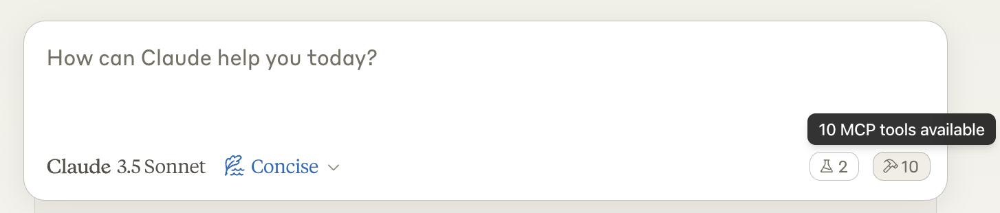
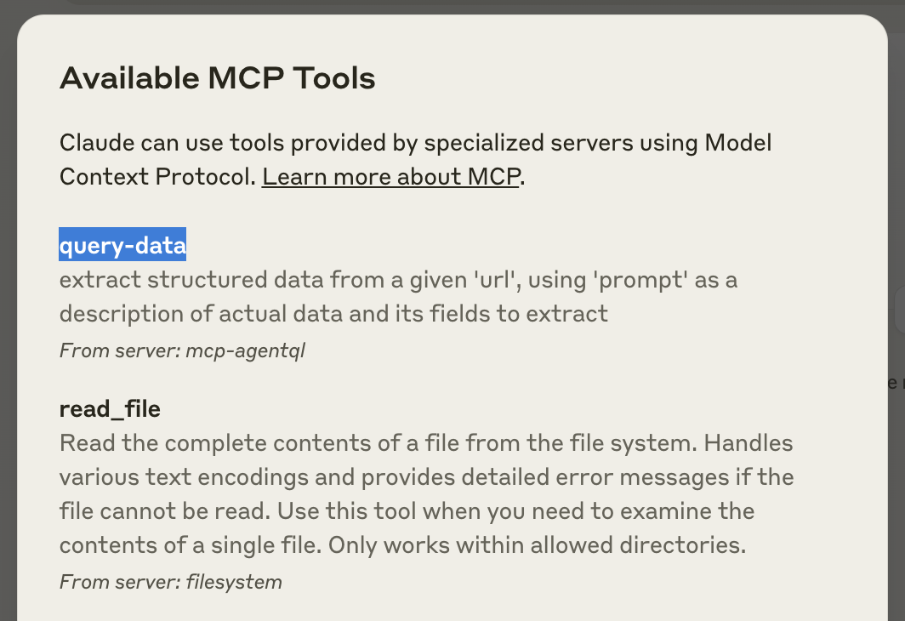
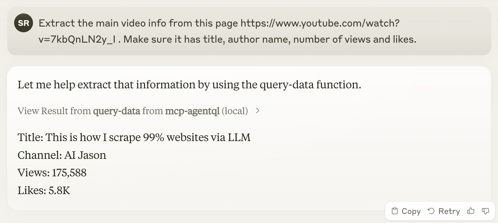

# mcp-agentql MCP Server

An MCP server to work with AgentQL

This is a TypeScript-based MCP server that implements triggering AgentQL REST API.

## Features

### Tools

- `query-data` - extract structured data from a given 'url', using 'prompt' as a description of actual data and its fields to extract

## Development

Install dependencies:

```bash
npm install
```

Build the server:

```bash
npm run build
```

For development with auto-rebuild:

```bash
npm run watch
```

## Installation

To use with Claude Desktop, add the server config:

On MacOS: `~/Library/Application Support/Claude/claude_desktop_config.json`
On Windows: `%APPDATA%/Claude/claude_desktop_config.json`

### For Published Version

1. Create a `~/.npmrc` file with this content:

    ```title="~/.npmrc"
    //npm.pkg.github.com/:_authToken=TOKEN
    @tinyfish-io:registry=https://npm.pkg.github.com
    ```

2. Replace `TOKEN` with your [personal access token (classic)](https://github.com/settings/tokens) using [this guide](https://docs.github.com/en/packages/working-with-a-github-packages-registry/working-with-the-npm-registry#authenticating-with-a-personal-access-token).

3. Install the package from private NPM registry:

    ```bash
    npm install -g @tinyfish-io/mcp-agentql
    ```

4. Finally add `agentql` plugin config inside `mcpServers` dict in `claude_desktop_config.json` file (don't forget to provide actual API key) and restart the app:

    ```json title="claude_desktop_config.json"
    {
      "mcpServers": {
        "agentql": {
          "command": "npx",
          "args": [
            "-y",
            "@tinyfish-io/mcp-agentql"
          ],
          "env": {
            "AGENTQL_API_KEY": "YOU_API_KEY"
          }
        }
      }
    }
    ```

### For Dev Version

For dev version the config content will change to refer to the work in progress code:

```json
{
  "mcpServers": {
    "agentql": {
      "command": "/path/to/aql-server/js/build/index.js",
      "env": {
        "AGENTQL_API_KEY": "YOU_API_KEY"
      }
    }
  }
}
```

### Validate

After restarting the app check the bottom right corner of the user message input area. It should show MCP tools button which you need to click:



The opened dialog should show newly added `query-data` tool in hte list, among the other tools from other plugin servers:



Now you can give Claude a task that will be able to use newly added tool. For example:

```text
Extract the main video info from this page https://www.youtube.com/watch?v=7kbQnLN2y_I. Make sure it has title, author name, number of views and likes.
```



> [!TIP]
> In case Claude complains that it can't open urls or load content from the web instead of usign AgentQL, try adding "use tools" or "use agentql tool" hint.

## Debugging

Since MCP servers communicate over stdio, debugging can be challenging. We recommend using the [MCP Inspector](https://github.com/modelcontextprotocol/inspector), which is available as a package script:

```bash
npm run inspector
```

The Inspector will provide a URL to access debugging tools in your browser.
